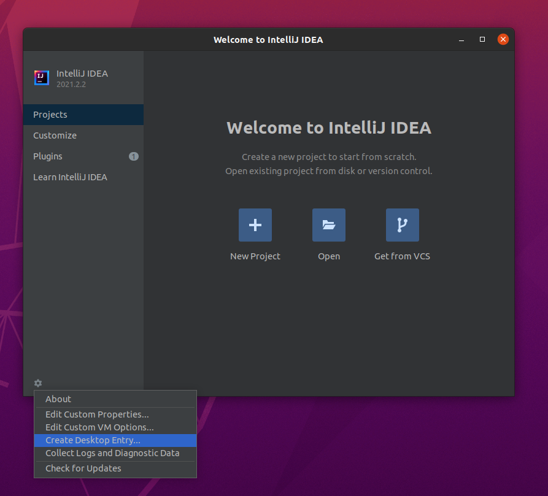

# Settings

This repository contains every settings for my personal dev environments.

## Machine & OS

## Languages

### Java

- Install
  - Use sdkman to install & manage jdks: [Link](https://sdkman.io/jdks)

### Go

- Install
  - Follow description in official web page: [Link](https://golang.org/doc/install)

## Applications & Tools

### JetBrains Mono

- Install
  - Follow description in official web page: [Link](https://github.com/JetBrains/JetBrainsMono)

### Zsh

- Install
  - Follow description in ohmyzsh web page: [Link](https://github.com/ohmyzsh/ohmyzsh/wiki/Installing-ZSH)
    - For the ubuntu, can install with apt like `apt install zsh`.

#### Oh-My-Zsh

- Install
  - Follow description in official web page: [Link](https://github.com/ohmyzsh/ohmyzsh)
- Config
  - Copy config file from `git://settings/zsh/zshrc` to `file://$HOME/.zshrc`.

### Neovim

- Install
  - Since apt does not reflects recent version of neovim quickly, installed with appimage. Go to release page & download appimage file to the `$HOME/Applications` directory. And make symbolic link like ` ln -s nvim.appimage nvim`.
    - Release page: [Link](https://github.com/neovim/neovim/releases)
- Config
  - Copy config file from `git://settings/nvim/init.vim` to `file://$HOME/.config/nvim/init.vim`.

#### Vim Plugins

- Use `junegunn/vim-plug` to manage plugins. Go to official page and follow guides to install & manage plugins including vim-plug: [Link](https://github.com/junegunn/vim-plug)

### Alacritty

- Install
  - Follow description in official web page: [Link](https://github.com/alacritty/alacritty/blob/master/INSTALL.md)
    1. Install rust & cargo.
    2. Install dependencies.
    3. Install alacritty with cargo.
- Config
  - Copy config file from `git://alacritty/alacritty.yml` to `file://$HOME/.config/alacritty/alacritty.yml`.

### Intellij

- Install
  - Download idea file via official download page. And put it in to `$HOME/Applications` directory. And make symblokc link like `ln -s idea-IC-212.5284.40 idea`. And launch application via `idea/bin/idea.sh`. After that, create desktop entry by clicking option in `Configure`.
    - Download page: [Link](https://www.jetbrains.com/ko-kr/idea/download/#section=linux)

